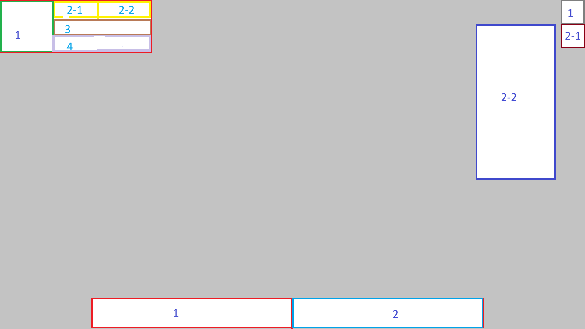
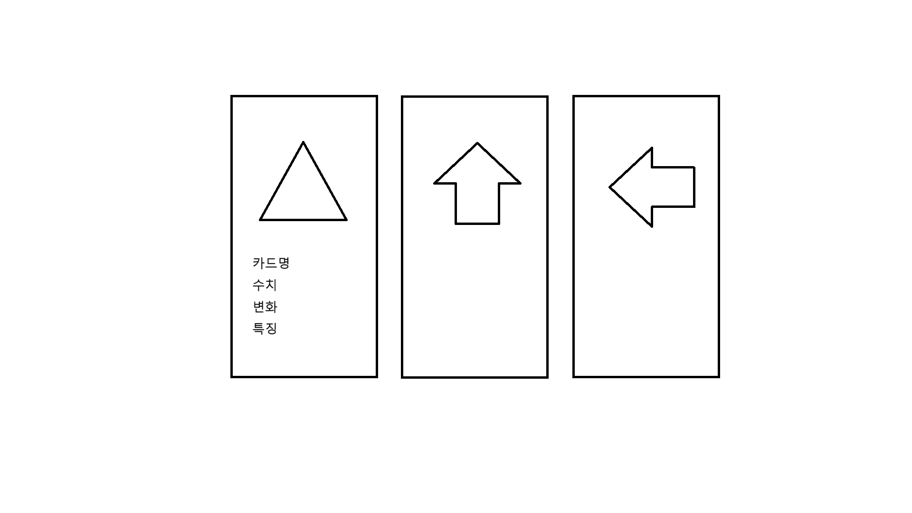

# Circular 기초 설계

## 씬 종류
    - 로딩 
    - 타이틀
        - 시작 <- 난이도설정 -> ( 난이도는 노말(Normal) - 하드(Hard) - 베리하드(Very Hard) - 하드코어(Hardcore) - 익스트림(Extreme) - 인세인(Insane) )
        - 강화 ( 다회차 유도 디테일한 강화트리는 설정은 차후 추가 )
        - 설정
        - 종료
    - 인게임

## 장르
뱀서 라이크류 + 다양한 스테이지 콘셉트

## 규칙
- 직접적인 공격 x, 소지 무기별 자동 공격
- 플레이어는 이동만 가능 (걷기, 달리기, 대쉬)

### 스테이지 정리
    - 1 ~ 5    : 마계숲 ( Slay the spier 같은 라운드 개념 이동의 선택지)
    - 6 ~ 10   : 초원 ( 단일 일직선노선 )
    - 11 ~ 15  : 인간마을 ( 미정 )
    - 16 ~ 20  : 왕국 성 ( 아이작같은 라운드 개념, 보스방까지 탐험 필요, 보스는 왕의 기사 )

## Playable character

콘셉트 : 마왕군 4대장의 xx왕국 침공

    1. 마도기사
    2. 스컬매지션
    3. 서큐버스
    4. 어쎄신리자드

# UI 설계

#### 규칙
 - 키보드 사용시 마우스는 고정, 보이지 않도록
 - 마우스 사용시 고정 해제, 보이도록
 - 마우스가 올라간 Widget은 아웃라인을 활성화

## HUD

### 좌 상단
    (1) 캐릭터 초상화
    (2) 재화 ( -1 인게임 런 재화, -2 다회차 강화용 재화 )
    (3) 스테미너 ( 달리기, 대쉬 )
    (4) 궁극기 게이지 ( 일정 수 적 사냥시 궁극기 사용 )
    
### 우 상단
    (1) 설정창 열기
    (2) 스테이터스창 열기(팝업, 마우스가 올라간 상태에서만 보임 , 디테일한 능력치 종류는 미정)

### 중앙 하단
    (1) 소지 무기
    (2) 소지 장신구

## CardSelect

# 캐릭터 관련
### 무기

### 장신구

# 적 설정
기본 분류 : 근접, 탱커, 원거리, 마법, 보스

스테이지 마지막엔 보스
### 마계숲 
근접

### 초원
근접 탱커

### 인간마을
근접 원거리 탱커 마법

### 왕국 성
근접 원거리 탱커 마법

## 적 스폰 패턴

 - 일방통행 ( 한 방향에서 몰려온다. 디테일한 숫자, 속도, 모양[ 화살표, 직사각형 등]은 테이블을 설정)
 - 플레이어 기준 사각형으로 가두어 버림(방어력 높은 방패병)
 - 여러 줄의 적 소환 한 줄은 좌, 한 줄은 우 반복
 - 추가...